# 01 — Motivation / Strategy

**Pack:** Business (ArchiMate)  
**RACI:** EA **R**, Business Owner **A**, SA/BA/Sec **C**  
**Handbook:** §3.1, §4.1  
**Language:** ArchiMate only — do not mix C4 protocol labels or UML messages.  
**Glossary:** [20-appendix.md](20-appendix.md)  
**Names:** use the name-identity list on [00-index.md](00-index.md).

## Diagram header

```
Title:      Motivation / Strategy — Mobile Personal Loan Product
Viewpoint:  ArchiMate
Layer(s):   Strategy / Business / App
As-Is | To-Be | Transition:  To-Be
Owner:      Role Product Owner / Enterprise Architect  Name ________
Version:    v0.1.0  Date 2026-08-21  Status Draft
Legend:     motivation, goal, outcome, capability, requirement, constraint
Scope:      in-scope mobile lending product / out-of-scope branch-based manual lending
```

## Status

| Field | Value |
| --- | --- |
| Status | Draft |
| N/A reason | Not applicable |
| Owner | EA / Product Owner |
| Date | 2026-08-21 |

## Purpose

This motivation and strategy view explains why the organization is changing to a mobile-first personal loan product, what strategic goals it is pursuing, and which business capabilities and constraints shape the solution.

The view follows TOGAF-aligned architecture thinking: drivers motivate strategic goals, goals lead to desired outcomes, and capabilities/requirements define the needed business and solution response.

## Diagram

```mermaid
flowchart TB
  STK1[Stakeholder: Customer]
  STK2[Stakeholder: Bank Owner]
  STK3[Stakeholder: Risk / Compliance]

  DRV1[Driver: Need for faster digital loan decisions]
  DRV2[Driver: Need to personalize credit offers]
  DRV3[Driver: Need for secure, auditable banking integration]
  DRV4[Driver: Need for immediate access to funds]

  GOAL1[Goal: Deliver mobile-first personal loan experience]
  GOAL2[Goal: Automate decisioning for eligible salaried customers]
  GOAL3[Goal: Provide personalized limit and rate recommendations]
  GOAL4[Goal: Ensure reliable accounting and disbursement integration]
  GOAL5[Goal: Maintain traceability, security, and compliance]

  OUT1[Outcome: Near real-time loan decisions]
  OUT2[Outcome: Higher conversion with lower manual underwriting]
  OUT3[Outcome: Personalized and policy-compliant loan offers]
  OUT4[Outcome: Immediate disbursement after approval]
  OUT5[Outcome: Audit-ready decision and accounting evidence]

  CAP1[Capability: Loan application intake]
  CAP2[Capability: Customer eligibility and scoring]
  CAP3[Capability: Policy-based maximum amount calculation]
  CAP4[Capability: Offer generation and auto-decisioning]
  CAP5[Capability: Disbursement and accounting integration]
  CAP6[Capability: Decision traceability and audit]

  REQ1[Requirement: FR-01 Loan submission via mobile app]
  REQ2[Requirement: FR-03 Credit score retrieval]
  REQ3[Requirement: FR-04 Max eligible amount calculation]
  REQ4[Requirement: FR-05 Personalized interest rate]
  REQ5[Requirement: FR-07 Auto decisioning]
  REQ6[Requirement: FR-09 Immediate disbursement]
  REQ7[Requirement: FR-10 Accounting integration via ESB]
  REQ8[Requirement: FR-11 Decision traceability]

  CON1[Constraint: Max unsecured loan = 100,000,000 VND]
  CON2[Constraint: Existing salaried customers aged 22–35]
  CON3[Constraint: Near real-time credit scoring integration]
  CON4[Constraint: Strong security and auditability]

  STK1 --> DRV1
  STK2 --> DRV2
  STK3 --> DRV3
  STK2 --> DRV4

  DRV1 --> GOAL1
  DRV2 --> GOAL2
  DRV2 --> GOAL3
  DRV3 --> GOAL4
  DRV4 --> GOAL5

  GOAL1 --> OUT1
  GOAL2 --> OUT2
  GOAL3 --> OUT3
  GOAL4 --> OUT4
  GOAL5 --> OUT5

  GOAL1 --> CAP1
  GOAL2 --> CAP2
  GOAL3 --> CAP3
  GOAL3 --> CAP4
  GOAL4 --> CAP5
  GOAL5 --> CAP6

  CAP1 --> REQ1
  CAP2 --> REQ2
  CAP3 --> REQ3
  CAP4 --> REQ4
  CAP4 --> REQ5
  CAP5 --> REQ6
  CAP5 --> REQ7
  CAP6 --> REQ8

  CON1 --> GOAL2
  CON2 --> GOAL1
  CON3 --> GOAL2
  CON4 --> GOAL5
```



## ID table

| ID | Element | Type | Statement |
| --- | --- | --- | --- |
| MOT.DRV.01 | Customer experience pressure | Driver | Customers expect fast, mobile, low-friction loan decisions for everyday banking journeys. |
| MOT.DRV.02 | Risk-based lending efficiency | Driver | The bank needs a scalable way to personalize offers while controlling credit exposure. |
| MOT.DRV.03 | Accounting and compliance assurance | Driver | Lending must integrate securely with core banking and maintain a clear audit trail. |
| MOT.DRV.04 | Disbursement expectation | Driver | Approved customers expect rapid access to funds immediately after approval. |
| MOT.GOAL.01 | Mobile-first personal loan onboarding | Goal | Enable customers to submit and complete a personal loan application through the mobile app. |
| MOT.GOAL.02 | Automated near-real-time decisioning | Goal | Evaluate eligibility, scoring, and policy rules without manual underwriting for standard cases. |
| MOT.GOAL.03 | Personalized lending offer | Goal | Recommend a maximum eligible amount and appropriate interest rate based on risk and policy. |
| MOT.GOAL.04 | Reliable disbursement and accounting | Goal | Disburse approved funds immediately while posting accounting entries correctly via the ESB and Core Banking layer. |
| MOT.GOAL.05 | Trust and auditability | Goal | Ensure decisions, policy basis, calculations, and external interactions are explainable and reviewable. |
| MOT.OUT.01 | Faster approvals | Outcome | Loan applications are evaluated in near real time and decisions are returned quickly. |
| MOT.OUT.02 | Better conversion | Outcome | More eligible customers complete the digital journey without branch or manual intervention. |
| MOT.OUT.03 | Lower underwriting friction | Outcome | Standard applications are approved or rejected automatically under policy. |
| MOT.OUT.04 | Reduced operational risk | Outcome | Accounting flows and disbursement actions are more reliable and auditable. |
| MOT.OUT.05 | Compliant and explainable credit decisions | Outcome | Decision records show the score, policy, and calculations used for the final outcome. |
| STR.CAP.01 | Loan application intake | Capability | Capture and validate customer loan requests through the digital channel. |
| STR.CAP.02 | Eligibility and scoring management | Capability | Assess customer eligibility and retrieve a near-real-time credit score. |
| STR.CAP.03 | Policy and offer calculation | Capability | Calculate eligible amount and pricing based on risk and business rules. |
| STR.CAP.04 | Auto-decision engine | Capability | Approve or reject applications according to policy and score thresholds. |
| STR.CAP.05 | Disbursement and accounting orchestration | Capability | Validate account eligibility, trigger disbursement, and send accounting entries through ESB to Core Banking. |
| STR.CAP.06 | Decision traceability and audit | Capability | Persist decision artifacts and transaction evidence for compliance and dispute resolution. |
| MOT.REQ.01 | FR-01 Loan application submission | Requirement | The system shall allow a customer to submit a loan application via the mobile app. |
| MOT.REQ.02 | FR-02 Customer eligibility assessment | Requirement | The system shall evaluate customer eligibility based on available customer and credit data. |
| MOT.REQ.03 | FR-03 Credit scoring integration | Requirement | The system shall integrate with a credit scoring system to obtain a near real-time credit score. |
| MOT.REQ.04 | FR-04 Maximum eligible amount calculation | Requirement | The system shall calculate the maximum borrowable amount based on policy rules. |
| MOT.REQ.05 | FR-05 Personalized interest rate | Requirement | The system shall determine a customized interest rate for each customer. |
| MOT.REQ.06 | FR-06 Offer recommendation | Requirement | The system shall propose a loan offer with an amount and rate. |
| MOT.REQ.07 | FR-07 Auto decisioning | Requirement | The system shall automatically approve or reject the application when within policy thresholds. |
| MOT.REQ.08 | FR-09 Immediate disbursement | Requirement | Approved funds shall be disbursed immediately after validation. |
| MOT.REQ.09 | FR-10 Accounting integration | Requirement | The system shall send accounting entries to Core Banking through ESB. |
| MOT.REQ.10 | FR-11 Decision traceability | Requirement | The system shall retain the score, policy basis, and calculated amount for decision explanation. |
| MOT.CON.01 | Product limit constraint | Constraint | Unsecured personal loan maximum amount is capped at 100,000,000 VND. |
| MOT.CON.02 | Target customer segment | Constraint | Product is for existing salaried customers aged 22–35. |
| MOT.CON.03 | Real-time external dependency | Constraint | Credit scoring must be integrated and available near real time. |
| MOT.CON.04 | Security and compliance requirement | Constraint | Customer data, decisioning, and accounting operations must be protected, auditable, and compliant. |

## TOGAF-aligned interpretation

This strategy view follows a standard enterprise architecture progression:

- Drivers identify the business pressure and opportunity.
- Goals define the desired future state.
- Outcomes measure the value created.
- Capabilities describe the business ability required to achieve the goals.
- Requirements and constraints turn the strategic intent into traceable solution conditions.

In this product, the core strategic intent is to create a low-friction digital lending capability that is fast, personalized, auditable, and integrated with core banking without sacrificing policy control or security.

## Design implication

The architecture should therefore emphasize:

- a mobile-first customer engagement channel,
- clear decisioning responsibilities separated from channel concerns,
- explicit credit scoring and accounting integration boundaries,
- policy-driven calculations for amount and rate,
- end-to-end decision evidence for audit and compliance.

This view is the enterprise rationale behind the later C4 and UML design views.
