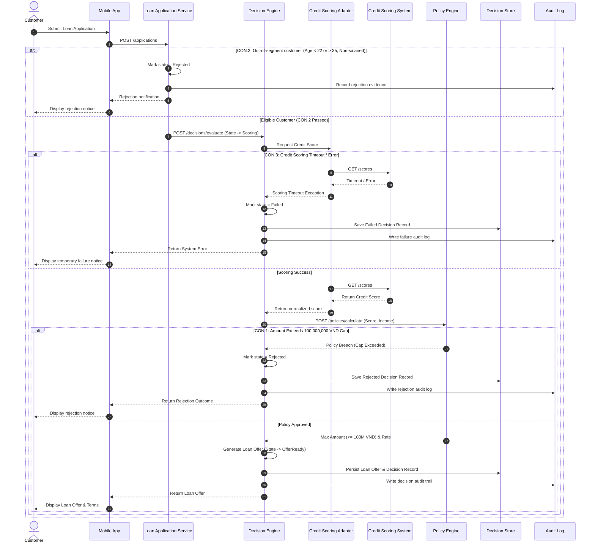
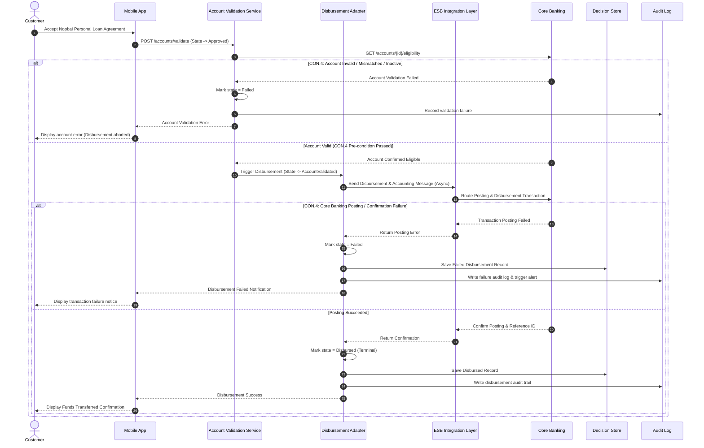
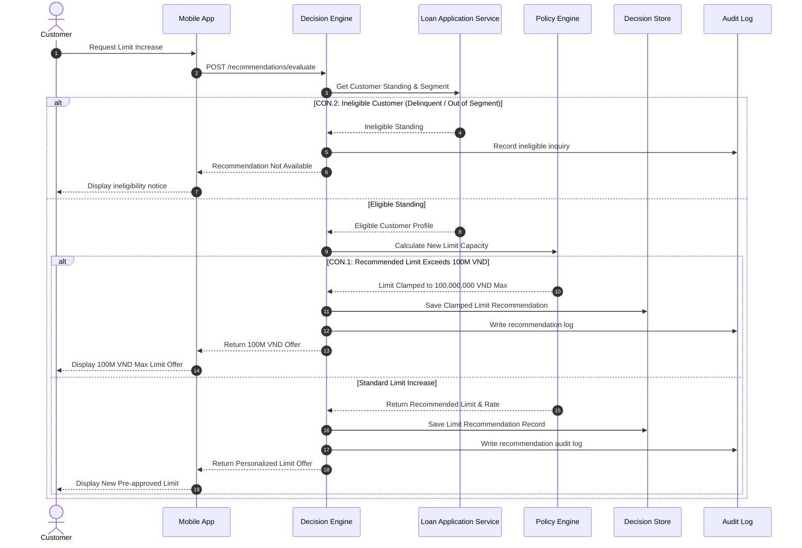
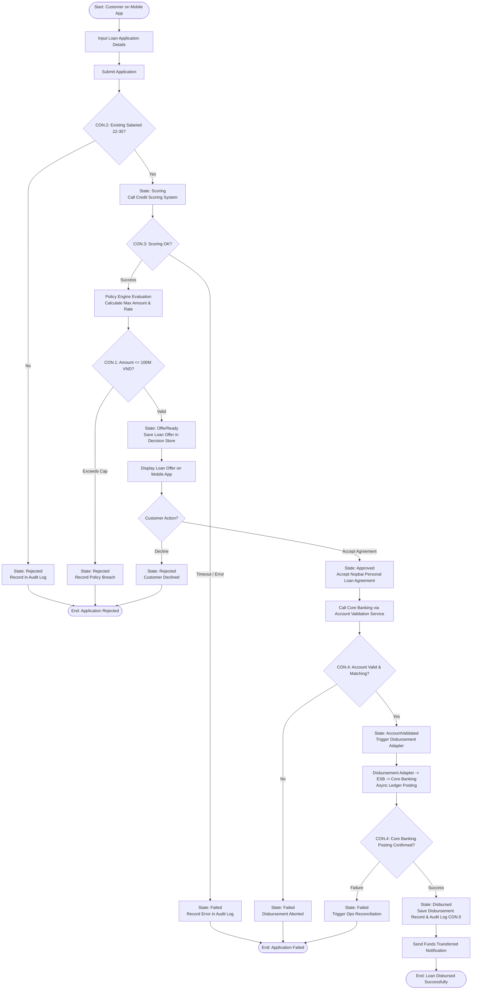
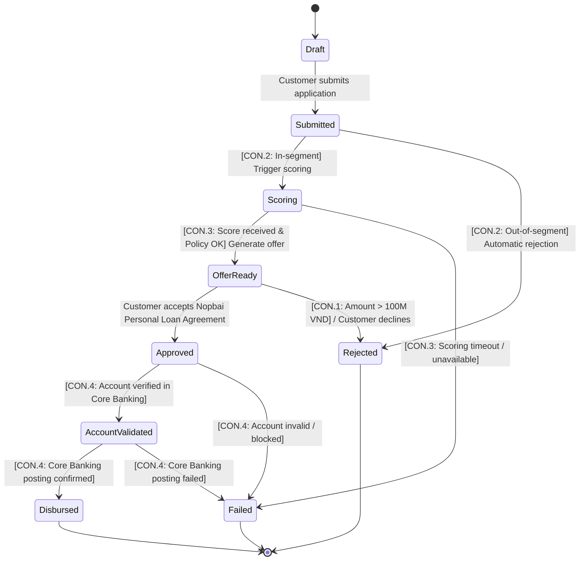

# Lab 5 — Low-level design (UML)

**R:** Dev (sequence) · Test (activity/state)  
**A:** SA (sequence) · BA (activity/state)  
**Status:** Lab 5 Before-pack UML design specification (current working style).  
**Rules:** No Guide standard header or RACI blocks (reserved for Lab 7–10 After-pack). No source code or runtime MVP.

---

## 1. Scope and Inputs

This document defines the low-level design (LLD) behavior models for the named use cases and business objects locked in Lab 1:

- **System-in-focus:** `Nopbai Personal Loan Platform`
- **Product & Contract:** `Nopbai Mobile Personal Loan` / `Nopbai Personal Loan Agreement`
- **Business Object in Focus:** `Loan Application`
- **Actors (I-2):** `Customer`, `Loan Operations Specialist`
- **Internal Containers (I-4):** `Mobile App`, `Loan Application Service`, `Credit Scoring Adapter`, `Decision Engine`, `Policy Engine`, `Account Validation Service`, `Disbursement Adapter`, `Decision Store`, `Audit Log`
- **External Systems (I-3):** `Credit Scoring System`, `ESB Integration Layer`, `Core Banking`
- **Constraints (I-10):** `CON.1` (Amount cap <= 100,000,000 VND), `CON.2` (Salaried customers aged 22–35), `CON.3` (Near-real-time scoring / timeout exception), `CON.4` (No disbursement before approval & account validation), `CON.5` (Auditability & data protection)
- **Named Use Cases (I-11):**
  1. `Submit and Decide Loan Application`
  2. `Disburse Approved Loan Application`
  3. `Recommend Limit Increase`

---

## 2. UML Sequence Diagrams (Named Use Cases)

### 2.1 Use Case 1: Submit and Decide Loan Application

#### Participants
- Actor: `Customer`
- Containers: `Mobile App`, `Loan Application Service`, `Decision Engine`, `Credit Scoring Adapter`, `Policy Engine`, `Decision Store`, `Audit Log`
- External System: `Credit Scoring System`

#### Interaction Table
| Step | Sender | Receiver | Message / Action | Note / Constraint |
|-----:|--------|----------|------------------|-------------------|
| 1 | `Customer` | `Mobile App` | Fill and submit `Loan Application` | Starts `Draft -> Submitted` |
| 2 | `Mobile App` | `Loan Application Service` | `POST /applications` (submit payload) | Validate application schema & segment |
| 3 | `Loan Application Service` | `Loan Application Service` | Validate segment rules (`CON.2`) | Check age 22–35 & salaried status |
| 4 | `Loan Application Service` | `Decision Engine` | `POST /decisions/evaluate` | Trigger automated decisioning (`Submitted -> Scoring`) |
| 5 | `Decision Engine` | `Credit Scoring Adapter` | Request normalized credit score | Sync request |
| 6 | `Credit Scoring Adapter` | `Credit Scoring System` | `GET /scores` (Customer ID) | External scoring inquiry |
| 7 | `Credit Scoring System` | `Credit Scoring Adapter` | Return credit score result | Near-real-time response (`CON.3`) |
| 8 | `Credit Scoring Adapter` | `Decision Engine` | Return normalized score | Score accepted |
| 9 | `Decision Engine` | `Policy Engine` | `POST /policies/calculate` | Request amount cap, rate, and rules |
| 10 | `Policy Engine` | `Decision Engine` | Return maximum amount & personalized rate | Verify `CON.1` (<= 100,000,000 VND) |
| 11 | `Decision Engine` | `Decision Engine` | Build `Loan Offer` | Transition `Scoring -> OfferReady` |
| 12 | `Decision Engine` | `Decision Store` | Save `Loan Offer` & `Decision Record` | Source of truth persistence |
| 13 | `Decision Engine` | `Audit Log` | Write decision & policy calculation evidence | `CON.5` auditability |
| 14 | `Decision Engine` | `Mobile App` | Return `Loan Offer` & decision outcome | Present terms to customer |
| 15 | `Mobile App` | `Customer` | Display `Loan Offer` details | Await agreement acceptance |

#### Alternative Branches (`alt`)
- **alt `CON.2` (Out of segment):** If `Loan Application Service` detects customer age < 22 or > 35, or non-salaried:
  - Transition state to `Rejected`.
  - Record rejection reason in `Audit Log`.
  - Return rejection notice to `Mobile App` (no scoring or decisioning triggered).
- **alt `CON.3` (Scoring timeout / unavailable):** If `Credit Scoring System` times out or fails:
  - `Credit Scoring Adapter` returns controlled error to `Decision Engine`.
  - Transition state to `Failed`.
  - Record error in `Decision Store` & `Audit Log`.
  - Return service unavailable message to `Mobile App` (no loan approval).
- **alt `CON.1` (Policy limit breach):** If requested amount exceeds policy cap (> 100,000,000 VND):
  - `Policy Engine` flags cap breach.
  - `Decision Engine` transitions state to `Rejected`.
  - Persist rejection in `Decision Store` and notify `Customer`.

#### Sequence Diagram (PlantUML / Mermaid)

---

### 2.2 Use Case 2: Disburse Approved Loan Application

#### Participants
- Actor: `Customer`
- Containers: `Mobile App`, `Account Validation Service`, `Disbursement Adapter`, `Decision Store`, `Audit Log`
- External Systems: `Core Banking`, `ESB Integration Layer`

#### Interaction Table
| Step | Sender | Receiver | Message / Action | Note / Constraint |
|-----:|--------|----------|------------------|-------------------|
| 1 | `Customer` | `Mobile App` | Accept `Nopbai Personal Loan Agreement` | Triggers `OfferReady -> Approved` |
| 2 | `Mobile App` | `Account Validation Service` | `POST /accounts/validate` | Initiate payment account verification |
| 3 | `Account Validation Service` | `Core Banking` | `GET /accounts/{id}/eligibility` | Sync verification with core ledger |
| 4 | `Core Banking` | `Account Validation Service` | Return account active & matching status | Account confirmed (`Approved -> AccountValidated`) |
| 5 | `Account Validation Service` | `Disbursement Adapter` | `POST /disbursements/execute` | Only execute after validation (`CON.4`) |
| 6 | `Disbursement Adapter` | `ESB Integration Layer` | Send disbursement message (idempotent key) | Async routing via ESB |
| 7 | `ESB Integration Layer` | `Core Banking` | Post disbursement ledger transaction | Core Banking credit posting |
| 8 | `Core Banking` | `ESB Integration Layer` | Confirm posting success | Return transaction reference |
| 9 | `ESB Integration Layer` | `Disbursement Adapter` | Return disbursement confirmation | Async message delivery |
| 10 | `Disbursement Adapter` | `Decision Store` | Save `Disbursement Record` (`AccountValidated -> Disbursed`) | State becomes terminal `Disbursed` |
| 11 | `Disbursement Adapter` | `Audit Log` | Write transaction evidence & timestamps | `CON.5` auditability |
| 12 | `Disbursement Adapter` | `Mobile App` | Notify disbursement completion | Status updated |
| 13 | `Mobile App` | `Customer` | Display success & funds disbursed notification | Journey finished |

#### Alternative Branches (`alt`)
- **alt `CON.4` (Account validation failed):** If `Core Banking` indicates payment account is closed, blocked, or mismatched:
  - `Account Validation Service` returns validation failure.
  - State transitions to `Failed`.
  - `Disbursement Adapter` aborts and sends no disbursement request to ESB.
  - Record failure in `Audit Log` and notify `Customer`.
- **alt `CON.4` (Core Banking posting / confirmation failed):** If `Core Banking` rejects the posting or network times out:
  - `Disbursement Adapter` catches failure/timeout.
  - State transitions to `Failed`.
  - Save `Disbursement Record` with failed status in `Decision Store` and `Audit Log`.
  - Trigger ops reconciliation alert for `Loan Operations Specialist`.

#### Sequence Diagram (PlantUML / Mermaid)

---

### 2.3 Use Case 3: Recommend Limit Increase

#### Participants
- Actor: `Customer`
- Containers: `Mobile App`, `Loan Application Service`, `Decision Engine`, `Policy Engine`, `Decision Store`, `Audit Log`

#### Interaction Table
| Step | Sender | Receiver | Message / Action | Note / Constraint |
|-----:|--------|----------|------------------|-------------------|
| 1 | `Customer` | `Mobile App` | Request limit increase evaluation | Existing borrower action |
| 2 | `Mobile App` | `Decision Engine` | `POST /recommendations/evaluate` | Start recommendation flow |
| 3 | `Decision Engine` | `Loan Application Service` | Query customer segment & repayment history | Verify `CON.2` eligibility |
| 4 | `Loan Application Service` | `Decision Engine` | Return customer profile & good standing | Segment confirmed |
| 5 | `Decision Engine` | `Policy Engine` | `POST /policies/recommend-limit` | Calculate limit increase capacity |
| 6 | `Policy Engine` | `Decision Engine` | Return recommended amount (capped by `CON.1`) | Must not exceed 100M VND |
| 7 | `Decision Engine` | `Decision Store` | Persist recommendation record | Store audit data |
| 8 | `Decision Engine` | `Audit Log` | Write recommendation evaluation trail | `CON.5` compliance |
| 9 | `Decision Engine` | `Mobile App` | Return limit-increase recommendation offer | Display offer |
| 10 | `Mobile App` | `Customer` | Display new eligible limit banner | Complete flow |

#### Alternative Branches (`alt`)
- **alt `CON.2` (Customer not eligible for recommendation):** If customer has overdue history or is outside segment:
  - `Decision Engine` rejects recommendation request.
  - Record event in `Audit Log` and notify `Customer`.
- **alt `CON.1` (Calculated limit > 100,000,000 VND cap):**
  - `Policy Engine` clamps or rejects recommendation exceeding 100,000,000 VND.

#### Sequence Diagram (PlantUML / Mermaid)

---

## 3. UML Activity Diagram (Business Process)

The Activity diagram illustrates the end-to-end flow of the `Loan Application` across business swimlanes, highlighting hard decision gates and constraints `CON.1` through `CON.5`.

---

## 4. UML State Machine (Object: Loan Application)

### 4.1 State Machine Specification
- **Object in Focus:** `Loan Application` (strictly one business object).
- **All States:** `Draft`, `Submitted`, `Scoring`, `OfferReady`, `Approved`, `AccountValidated`, `Rejected`, `Disbursed`, `Failed`.
- **Terminal States:** `Rejected`, `Disbursed`, `Failed`.

| From State | Event / Trigger | Guard / Condition | To State | Terminal? |
|:---|:---|:---|:---|:---:|
| `Draft` | Customer starts application | Details entered on Mobile App | `Submitted` | No |
| `Submitted` | Application submitted | Segment valid (Salaried, age 22–35) (`CON.2`) | `Scoring` | No |
| `Submitted` | Application submitted | Segment invalid (`CON.2`) | `Rejected` | **Yes** |
| `Scoring` | Credit score returned | Scoring response successful (`CON.3`) | `OfferReady` | No |
| `Scoring` | Scoring timeout/error | Scoring failed or timed out (`CON.3`) | `Failed` | **Yes** |
| `OfferReady` | Customer accepts agreement | Policy rules pass & accepted | `Approved` | No |
| `OfferReady` | Policy cap check | Amount > 100,000,000 VND (`CON.1`) | `Rejected` | **Yes** |
| `OfferReady` | Customer declines | Customer rejects the offer | `Rejected` | **Yes** |
| `Approved` | Account validation | Account valid & eligible (`CON.4`) | `AccountValidated` | No |
| `Approved` | Account validation | Account invalid / closed (`CON.4`) | `Failed` | **Yes** |
| `AccountValidated` | Core Banking confirmation | Ledger posting confirmed (`CON.4`) | `Disbursed` | **Yes** |
| `AccountValidated` | Core Banking confirmation | Ledger posting rejected/timeout (`CON.4`)| `Failed` | **Yes** |

### 4.2 State Machine Diagram

---

## 5. G6 Planned Test Coverage Checklist

The following table maps every state transition and sequence alternative (`alt`) to a planned test case, specifying the System Under Test (SUT) which strictly resolves to an internal container name from Lab 1 I-4.

### 5.1 State-Transition Test Cases
| Test ID | State Transition | Trigger & Test Scenario | Expected Outcome | SUT (I-4 Container) |
|:---|:---|:---|:---|:---|
| TC-ST-01 | `Draft -> Submitted` | Customer completes form and taps Submit on Mobile App | Application stored with `Submitted` status | `Mobile App` |
| TC-ST-02 | `Submitted -> Scoring` | Salaried customer aged 28 submits valid application | `CON.2` passes; scoring flow triggered | `Loan Application Service` |
| TC-ST-03 | `Submitted -> Rejected` | Non-salaried or age 38 customer submits application | `CON.2` fails; immediate rejection recorded | `Loan Application Service` |
| TC-ST-04 | `Scoring -> OfferReady` | Scoring Adapter returns score 720 within SLA | Offer calculated and stored in `Decision Store` | `Decision Engine` |
| TC-ST-05 | `Scoring -> Failed` | Scoring system fails to respond within 5s | `CON.3` timeout triggered; state set to `Failed` | `Credit Scoring Adapter` |
| TC-ST-06 | `OfferReady -> Approved` | Customer clicks "Accept Agreement" on Mobile App | Agreement recorded; state set to `Approved` | `Decision Engine` |
| TC-ST-07 | `OfferReady -> Rejected` | Requested loan calculated at 120,000,000 VND | `CON.1` cap breached; offer rejected | `Decision Engine` |
| TC-ST-08 | `OfferReady -> Rejected` | Customer taps "Decline Offer" on Mobile App | Customer declination recorded as `Rejected` | `Mobile App` |
| TC-ST-09 | `Approved -> AccountValidated` | Payment account confirmed active in Core Banking | Account eligibility verified successfully | `Account Validation Service` |
| TC-ST-10 | `Approved -> Failed` | Customer payment account is frozen/closed | `CON.4` check fails; disbursement blocked | `Account Validation Service` |
| TC-ST-11 | `AccountValidated -> Disbursed` | Core Banking confirms async ledger disbursement | State becomes terminal `Disbursed` | `Disbursement Adapter` |
| TC-ST-12 | `AccountValidated -> Failed` | Core Banking ledger posting returns insufficient balance/error | `CON.4` posting fails; state set to `Failed` | `Disbursement Adapter` |

### 5.2 Sequence Alternative (`alt`) Test Cases
| Test ID | Named Use Case | Alternative Branch | Test Scenario & Verification | SUT (I-4 Container) |
|:---|:---|:---|:---|:---|
| TC-ALT-01 | `Submit and Decide Loan Application` | `alt CON.2` (Out of segment) | Verify that no scoring API call is made and rejection notice is returned | `Loan Application Service` |
| TC-ALT-02 | `Submit and Decide Loan Application` | `alt CON.3` (Scoring timeout) | Verify timeout handling does not approve loan and marks application `Failed` | `Credit Scoring Adapter` |
| TC-ALT-03 | `Submit and Decide Loan Application` | `alt CON.1` (Amount cap > 100M) | Verify loan amounts > 100M VND are strictly rejected by policy engine | `Decision Engine` |
| TC-ALT-04 | `Disburse Approved Loan Application` | `alt CON.4` (Account invalid) | Verify no ESB message is sent when account validation fails | `Account Validation Service` |
| TC-ALT-05 | `Disburse Approved Loan Application` | `alt CON.4` (Posting failure) | Verify ledger failure is recorded and alert is raised without marking `Disbursed` | `Disbursement Adapter` |
| TC-ALT-06 | `Recommend Limit Increase` | `alt CON.2` (Ineligible customer) | Verify existing delinquent customer receives ineligibility message | `Decision Engine` |
| TC-ALT-07 | `Recommend Limit Increase` | `alt CON.1` (Limit cap at 100M) | Verify limit increase recommendation is capped at 100,000,000 VND | `Decision Engine` |

---

## 6. Lab 5 Completion Checklist

- [x] All 3 named use cases from Lab 1 I-11 have detailed UML sequence specifications & diagrams.
- [x] Every sequence diagram includes at least one `alt` branch mapped to a `CON.*` constraint.
- [x] Complete UML Activity diagram illustrates the end-to-end process and decision branches.
- [x] UML State Machine models exactly one business object (`Loan Application`) with I-6 states and terminal states.
- [x] G6 checklist covers 100% of state transitions (12 test cases) and sequence alternatives (7 test cases).
- [x] All participant and SUT names strictly resolve to Lab 1 I-2, I-3, and I-4 names.
- [x] Current working style maintained without premature Lab 7 Guide header or RACI blocks.
- [x] Ready to be archived in the Before-pack prior to Lab 7.
