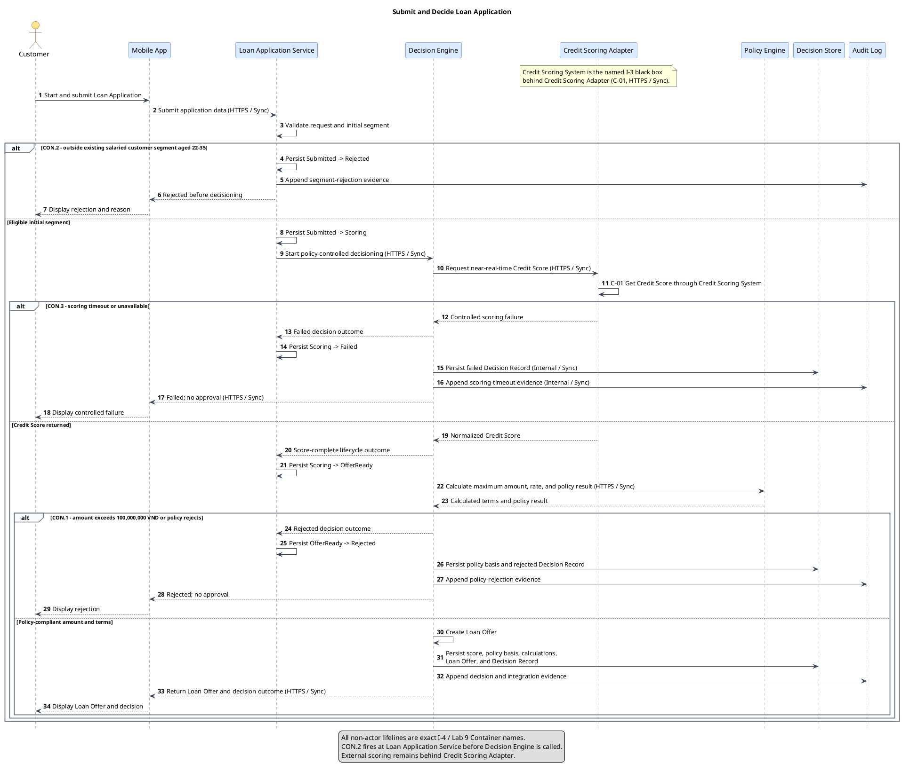
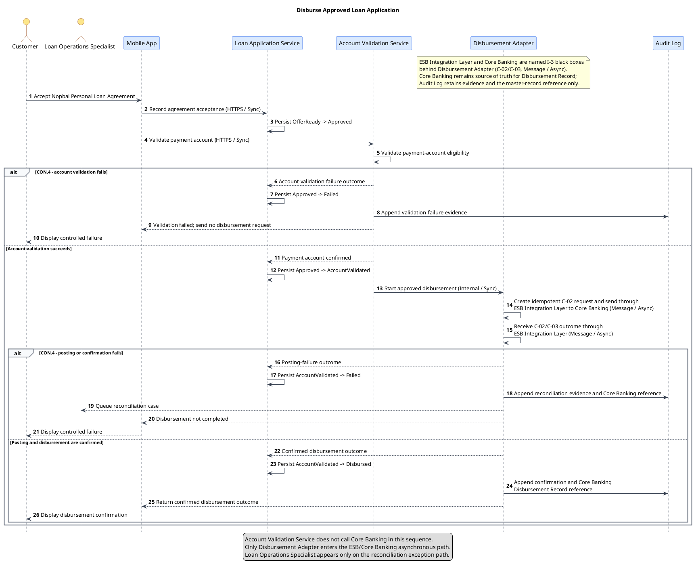
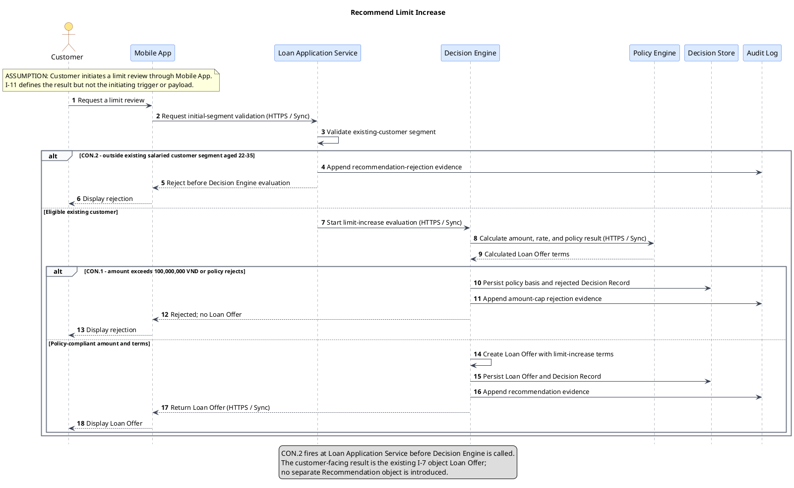

# Lab 10 - UML low-level design for named C4 use cases

```text
Title:      Nopbai Personal Loan Platform - Named-use-case UML audit
Viewpoint:  UML low-level design and G6 coverage
Layer(s):   Application behavior / Base design
As-Is | To-Be | Transition:  To-Be
Owner:      Dev - Nguyễn Thanh Hải
RACI:       R Dev - Nguyễn Thanh Hải
            A SA - Vũ Thế Quân
            C BA/Test - Lý Bá Duy; EA - Nguyễn Cương Quyết (TN)
            I Owner - Nguyễn Minh Hoàng
Version:    v1.0  Date 2026-08-22  Status Review
Legend:     actor, I-4 container lifeline, request, response, alt, and constraint
RACI legend: R = draws · A = approves · C = consulted · I = informed
Scope:      audit the three Lab 5 / I-11 use cases against Lab 9; no other use cases or container internals
```

## 1. Audit basis and boundaries

This after-pack artifact audits and restyles the existing before-pack `Lab-5-Low-level design (UML).md`. It does not replace or modify Lab 5. The archived before-pack copy remains unchanged.

| Source | Authority used here |
|--------|---------------------|
| Lab 1 I-2, I-4, I-6, I-7, I-11 | Actors, containers, lifecycle states, source-of-truth ownership, and the three named use cases |
| Lab 2 | `CON.1` through `CON.5` and exception semantics |
| Lab 5 | Before-pack sequences, activity, state machine, and planned tests T-01 through T-19 |
| Lab 6 | Adapter boundaries; no API Gateway or Event Bus participant exists |
| Lab 7 | After-pack header, RACI, and G6 rules |
| Lab 9 | Exact C4 Container names and allowed interaction boundaries |
| Team 4 Lab 10 feedback | Required corrections and the real Lab 5 comparison |

Audit rules:

- The use-case set remains exactly `Submit and Decide Loan Application`, `Disburse Approved Loan Application`, and `Recommend Limit Increase`.
- Actor lifelines use exact I-2 names. Every non-actor lifeline and every SUT uses an exact I-4 / Lab 9 Container name.
- The I-3 systems remain named black boxes behind the two adapter boundaries; they are not SUTs or additional Container lifelines.
- No internal component lifeline is required. If component detail is introduced later, it may be inside `Decision Engine` only.
- Each sequence is one canvas and contains at least one `alt` with the applicable `CON.*` identifier.
- This file is design and planned-coverage evidence only. It contains no source code, executed test, runtime, deployment, credential, or product installation.

## 2. Participant = SUT map

| Lifeline | Resolution | Use in audited sequence | SUT allowed? |
|----------|------------|-------------------------|--------------|
| `Customer` | Lab 1 I-2 actor | Standard customer interaction | No - actor |
| `Loan Operations Specialist` | Lab 1 I-2 actor | Exception/reconciliation interaction only | No - actor |
| `Mobile App` | Lab 1 I-4 / Lab 9 Container | Submission, presentation, acceptance, and customer outcome | Yes |
| `Loan Application Service` | Lab 1 I-4 / Lab 9 Container | Segment validation and `Loan Application` lifecycle management | Yes |
| `Credit Scoring Adapter` | Lab 1 I-4 / Lab 9 Container | Normalized scoring boundary | Yes |
| `Decision Engine` | Lab 1 I-4 / Lab 9 Container | Decision, offer, and recommendation orchestration | Yes |
| `Policy Engine` | Lab 1 I-4 / Lab 9 Container | Amount, rate, and policy evaluation | Yes |
| `Account Validation Service` | Lab 1 I-4 / Lab 9 Container | Payment-account validation | Yes |
| `Disbursement Adapter` | Lab 1 I-4 / Lab 9 Container | Idempotent asynchronous disbursement boundary | Yes |
| `Decision Store` | Lab 1 I-4 / Lab 9 Container | `Loan Offer` and `Decision Record` persistence | Yes |
| `Audit Log` | Lab 1 I-4 / Lab 9 Container | Decision, integration, and transaction evidence | Yes |

The following I-3 systems are referenced only in adapter notes and messages: `Credit Scoring System`, `ESB Integration Layer`, and `Core Banking`. `Decision Engine` does not call `Credit Scoring System` or `Core Banking` directly. `Mobile App` does not call `Core Banking` or perform credit evaluation.

## 3. Audited UML Sequence - Submit and Decide Loan Application

```text
Title:      Submit and Decide Loan Application
Viewpoint:  UML Sequence
Layer(s):   Application behavior / Base design
As-Is | To-Be | Transition:  To-Be
Owner:      Dev - Nguyễn Thanh Hải
RACI:       R Dev - Nguyễn Thanh Hải
            A SA - Vũ Thế Quân
            C BA/Test - Lý Bá Duy
            I EA - Nguyễn Cương Quyết (TN); Owner - Nguyễn Minh Hoàng
Version:    v1.0  Date 2026-08-22  Status Review
Legend:     solid arrow = request/command; dashed arrow = response; alt = constrained branch
RACI legend: R = draws · A = approves · C = consulted · I = informed
Scope:      submit, segment validation, scoring, policy decision, and Loan Offer
```



## 4. Audited UML Sequence - Disburse Approved Loan Application

```text
Title:      Disburse Approved Loan Application
Viewpoint:  UML Sequence
Layer(s):   Application behavior / Base design
As-Is | To-Be | Transition:  To-Be
Owner:      Dev - Nguyễn Thanh Hải
RACI:       R Dev - Nguyễn Thanh Hải
            A SA - Vũ Thế Quân
            C BA/Test - Lý Bá Duy
            I EA - Nguyễn Cương Quyết (TN); Owner - Nguyễn Minh Hoàng
Version:    v1.0  Date 2026-08-22  Status Review
Legend:     solid arrow = request/command; dashed arrow = response; alt = constrained branch
RACI legend: R = draws · A = approves · C = consulted · I = informed
Scope:      agreement acceptance, account validation, and confirmed asynchronous disbursement
```



## 5. Audited UML Sequence - Recommend Limit Increase

```text
Title:      Recommend Limit Increase
Viewpoint:  UML Sequence
Layer(s):   Application behavior / Base design
As-Is | To-Be | Transition:  To-Be
Owner:      Dev - Nguyễn Thanh Hải
RACI:       R Dev - Nguyễn Thanh Hải
            A SA - Vũ Thế Quân
            C BA/Test - Lý Bá Duy
            I EA - Nguyễn Cương Quyết (TN); Owner - Nguyễn Minh Hoàng
Version:    v1.0  Date 2026-08-22  Status Review
Legend:     solid arrow = request/command; dashed arrow = response; alt = constrained branch
RACI legend: R = draws · A = approves · C = consulted · I = informed
Scope:      eligible existing-customer limit-increase Loan Offer
```



## 6. Lab 5 Activity and State audit

Lab 5 already contains the required UML Activity and UML State artifacts. In accordance with the Lab 10 output rule, the State machine is not redrawn here. The following audit confirms that the existing diagrams remain valid against Lab 1 and Lab 9.

### 6.1 Activity audit against I-5

| I-5 step | Lab 5 activity evidence | Lab 10 audit result |
|---------:|-------------------------|---------------------|
| 1 | `Customer` submits `Loan Application` through `Mobile App` | Retained; `Draft -> Submitted` |
| 2 | `Loan Application Service` validates before `Decision Engine`, `Credit Scoring Adapter`, and `Policy Engine` processing | Retained; `CON.2` occurs before decisioning and `CON.3` prevents approval without score |
| 3 | `Decision Engine` creates `Loan Offer`, returns it through `Mobile App`, and records `Decision Store` / `Audit Log` evidence | Retained; `CON.1` rejects a cap breach |
| 4 | `Customer` accepts `Nopbai Personal Loan Agreement` | Retained; acceptance enters through `Mobile App` |
| 5 | `Account Validation Service` validates the payment account | Retained; failure sends no request to `Disbursement Adapter` |
| 6 | `Disbursement Adapter` sends asynchronously through `ESB Integration Layer` to `Core Banking` and awaits confirmation | Retained; failure is reconciled under `CON.4` |

`CON.5` remains cross-cutting: access is authenticated and authorized, and customer, decision, integration, and transaction evidence is protected and auditable. No product-specific security mechanism is invented.

### 6.2 State audit

- Lifecycle object: exactly one `Loan Application`.
- Exact states: `Draft`, `Submitted`, `Scoring`, `OfferReady`, `Approved`, `AccountValidated`, `Rejected`, `Disbursed`, and `Failed`.
- Exact terminal states: `Rejected`, `Disbursed`, and `Failed`.
- Exact business-transition count: twelve.
- Result: Lab 5 State matches I-6; a duplicate Lab 10 State diagram is not required.

## 7. G6 planned coverage

```text
Title:      G6 coverage for named-use-case UML
Viewpoint:  UML audit and planned test coverage
Layer(s):   Application behavior / Base design
As-Is | To-Be | Transition:  To-Be
Owner:      Test - Lý Bá Duy
RACI:       R Test - Lý Bá Duy
            A SA - Vũ Thế Quân
            C Dev - Nguyễn Thanh Hải; EA - Nguyễn Cương Quyết (TN)
            I Owner - Nguyễn Minh Hoàng
Version:    v1.0  Date 2026-08-22  Status Review
Legend:     G6-S = state transition; G6-A = drawn sequence alternative; SUT = exact I-4 container
RACI legend: R = draws · A = approves · C = consulted · I = informed
Scope:      all twelve I-6 transitions and all seven alternatives drawn in Sections 3-5
```

The rows are planned design evidence only. They do not claim execution, runtime evidence, UAT completion, or G6 approval.

### 7.1 State-transition coverage

| Coverage ID | Lab 5 test | I-6 transition | Planned scenario | SUT | Execution |
|-------------|------------|----------------|------------------|-----|-----------|
| `G6-S01` | `T-01` | `Draft -> Submitted` | Customer starts and submits a Loan Application | `Mobile App` | Not executed |
| `G6-S02` | `T-02` | `Submitted -> Scoring` | Valid in-segment application starts decisioning | `Loan Application Service` | Not executed |
| `G6-S03` | `T-03` | `Submitted -> Rejected` (`CON.2`) | Out-of-segment application is rejected before Decision Engine is called | `Loan Application Service` | Not executed |
| `G6-S04` | `T-04` | `Scoring -> OfferReady` | Normalized Credit Score and accepted policy input allow a Loan Offer | `Decision Engine` | Not executed |
| `G6-S05` | `T-05` | `Scoring -> Failed` (`CON.3`) | Scoring timeout produces controlled failure and no approval | `Credit Scoring Adapter` | Not executed |
| `G6-S06` | `T-06` | `OfferReady -> Approved` | Customer accepts `Nopbai Personal Loan Agreement` through Mobile App | `Mobile App` | Not executed |
| `G6-S07` | `T-07` | `OfferReady -> Rejected` (`CON.1`) | Amount cap or policy rejection rejects the Loan Offer | `Decision Engine` | Not executed |
| `G6-S08` | `T-08` | `OfferReady -> Rejected` | Customer declines the Loan Offer | `Mobile App` | Not executed |
| `G6-S09` | `T-09` | `Approved -> AccountValidated` | Account Validation Service confirms an eligible payment account | `Account Validation Service` | Not executed |
| `G6-S10` | `T-10` | `Approved -> Failed` (`CON.4`) | Account validation fails and no disbursement request is sent | `Account Validation Service` | Not executed |
| `G6-S11` | `T-11` | `AccountValidated -> Disbursed` | Confirmed ESB/Core Banking outcome completes disbursement | `Disbursement Adapter` | Not executed |
| `G6-S12` | `T-12` | `AccountValidated -> Failed` (`CON.4`) | Posting or confirmation failure prevents `Disbursed` and starts reconciliation | `Disbursement Adapter` | Not executed |

### 7.2 Sequence-alternative coverage

| Coverage ID | Lab 5 test | Named use case | Drawn `alt` | SUT | Expected result | Execution |
|-------------|------------|----------------|-------------|-----|-----------------|-----------|
| `G6-A01` | `T-13` | `Submit and Decide Loan Application` | `CON.2` outside initial segment | `Loan Application Service` | Reject before decisioning; skip scoring and approval | Not executed |
| `G6-A02` | `T-14` | `Submit and Decide Loan Application` | `CON.3` scoring timeout | `Credit Scoring Adapter` | Controlled `Failed`; no approval | Not executed |
| `G6-A03` | `T-15` | `Submit and Decide Loan Application` | `CON.1` amount cap or policy rejection | `Decision Engine` | Reject Loan Offer and retain policy evidence | Not executed |
| `G6-A04` | `T-16` | `Disburse Approved Loan Application` | `CON.4` account-validation failure | `Account Validation Service` | Send no request to Disbursement Adapter; enter `Failed` | Not executed |
| `G6-A05` | `T-17` | `Disburse Approved Loan Application` | `CON.4` posting or confirmation failure | `Disbursement Adapter` | Do not mark `Disbursed`; retain reconciliation evidence | Not executed |
| `G6-A06` | `T-18` | `Recommend Limit Increase` | `CON.2` outside initial segment | `Loan Application Service` | Reject before Decision Engine evaluation | Not executed |
| `G6-A07` | `T-19` | `Recommend Limit Increase` | `CON.1` amount cap or policy rejection | `Decision Engine` | Reject; persist policy basis; return no Loan Offer | Not executed |

**G6 status:** coverage is complete as planned evidence and remains **Pending** until Test/SA review. Pending does not mean executed or approved.

## 8. Feedback correction register

| Feedback item | Correction in this Lab 10 |
|---------------|---------------------------|
| Lab 5 was skipped | The existing Lab 5 file and archived before-pack copy are the explicit audit baseline |
| `CON.2` had two owners | `Loan Application Service` rejects before `Decision Engine` in both relevant sequences; no `Eligibility Evaluator` lifeline is used |
| Extra `Account Validation Service -> Core Banking` HTTPS edge | Removed; account validation completes before `Disbursement Adapter` enters the ESB/Core Banking asynchronous path |
| `G6-S06` used the wrong SUT | `OfferReady -> Approved` uses `Mobile App` as SUT |
| Limit-increase result was a new recommendation object | The result is the existing I-7 `Loan Offer` |
| `Disbursement Record` had a second master | `Core Banking` remains source of truth; `Audit Log` retains evidence and a reference only |
| Activity handling was unclear | Lab 5 Activity is audited against all six I-5 steps and is not unnecessarily duplicated |
| State RACI could make BA/Test self-approve | Coverage/state audit uses Test Lý Bá Duy as R and SA Vũ Thế Quân as A, preserving R != A |

## 9. Comparison note - Lab 5 before pack versus Lab 10 after pack

| Audit dimension | Lab 5 before-pack baseline | Lab 10 audited result |
|-----------------|----------------------------|-----------------------|
| Named use cases | Three I-11 sequences, one canvas each | Same three sequences; no second use-case set invented |
| Participant names | Exact I-2 actors and I-4 container lifelines; I-3 systems behind adapters | Names retained and explicitly resolved to Lab 9; no unnamed or new participant |
| Component grain | Container lifelines only | Retained; no module lifeline is needed, and no unselected container is expanded |
| `CON.2` ownership | `Loan Application Service` rejects before decisioning | Retained and explicitly verified in Submit/Decide and Limit Increase |
| Account-validation boundary | No direct `Account Validation Service -> Core Banking` call; disbursement crosses the adapter boundary | Retained; only `Disbursement Adapter` enters the asynchronous ESB/Core Banking path |
| Customer-facing recommendation | `Loan Offer` | Retained; no third recommendation object introduced |
| `Disbursement Record` ownership | `Core Banking` master; Audit Log stores the reference/evidence | Retained and made explicit in the disbursement sequence |
| Activity | I-5 happy path with `CON.1` through `CON.5` decisions | Audited in Section 6; not redrawn because Lab 5 already supplies it |
| State | One `Loan Application`; nine exact states and twelve transitions | Audited in Section 6; not redrawn because Lab 5 already supplies it |
| G6 | T-01 through T-19 are planned and not executed | All twelve transitions and all seven drawn alternatives map to G6-S/G6-A rows |
| Header and RACI | Intentionally absent in the current-style before pack | Added per after-pack Guide with exactly one R and one A per artifact |
| Language and notation | English UML in current presentation style | English UML retained; C4 names are referenced without mixing C4 or ArchiMate notation into the sequence canvases |
| Before-pack preservation | Live and archived Lab 5 copies exist | Neither Lab 5 nor its archive copy is modified by this audit |

## 10. Completion check

- [x] Lab 5 exists and is used as the real before-pack audit baseline.
- [x] One audited UML Sequence exists for each of the three I-11 named use cases.
- [x] Every sequence is a separate PlantUML canvas and includes at least one `alt` with `CON.*`.
- [x] Every non-actor lifeline and every SUT resolves to an exact I-4 / Lab 9 Container name.
- [x] I-3 systems remain named black boxes behind adapters and are not SUTs.
- [x] No container internals are introduced; therefore no unselected container is expanded.
- [x] The existing Lab 5 Activity matches I-5 and the existing State machine matches the one `Loan Application` / I-6 lifecycle.
- [x] G6 lists every one of the twelve state transitions and all seven sequence alternatives as planned, not executed.
- [x] Every after-pack view has a complete header, legend, scope, and RACI with R != A.
- [x] The comparison note records the real Lab 5 before-pack baseline versus this after-pack audit.
- [x] No source code, runtime test, MVP, deployment, credential, product, gateway, event bus, or new system is introduced.
- [x] The before pack remains present and unchanged.
- [ ] G6 formally approved by Test/SA.

**Current result:** Lab 10 is complete as a Review-ready after-pack UML artifact. G6 planned coverage is complete but remains `Pending` until Test/SA approval; no test execution or gate approval is claimed.
