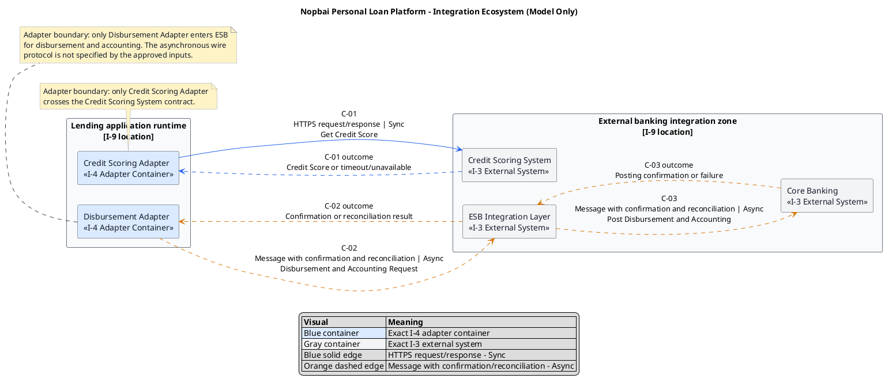

# Lab 6 - Integration ecosystem (model, do not build)

This before-pack artifact models the integration ecosystem of `Nopbai Personal Loan Platform`. It uses the exact I-3, I-4, I-8, and I-9 names from Lab 1 and the three contract rows from Lab 3. It is design evidence only: no product is installed, configured, or operated, and no Guide header or RACI is applied.

Only elements that already exist in I-4 may be modeled as internal containers. I-4 contains two adapters but no API Gateway and no Event Bus. `ESB Integration Layer` remains an I-3 external system and is not reclassified as an internal bus.

## 1. Container-selection decision

| Integration element | Present in I-4? | Modeling decision |
|---------------------|-----------------|-------------------|
| API Gateway | No | Omitted; no gateway or gateway product is introduced |
| Event Bus / Message Broker | No | Omitted; no broker or event-bus product is introduced |
| `Credit Scoring Adapter` | Yes | Drawn as an I-4 adapter container in `Lending application runtime` |
| `Disbursement Adapter` | Yes | Drawn as an I-4 adapter container in `Lending application runtime` |
| `ESB Integration Layer` | No; it is I-3 | Drawn only as an external system in `External banking integration zone` |

## 2. Ecosystem sketch

The diagram intentionally contains no API Gateway, Event Bus, IAM product, database product, vendor product, host, pod, or cluster. Return arrows are outcomes on C-01 through C-03, not additional contracts.

## 3. Edge-label and contract register

The following rows reproduce the approved I-8/Lab 3 integration edges. No new contract is introduced.

| Contract | Producer | Consumer | Protocol / mechanism | Mode | Operation or message | Failure and confirmation behavior |
|----------|----------|----------|----------------------|------|----------------------|-----------------------------------|
| `C-01` | `Credit Scoring Adapter` | `Credit Scoring System` | HTTPS request/response | Sync | `Get Credit Score` | Timeout or unavailable response is controlled; `Scoring -> Failed`; no approval |
| `C-02` | `Disbursement Adapter` | `ESB Integration Layer` | Message with confirmation and reconciliation; wire protocol not specified | Async | `Disbursement and Accounting Request` | Do not mark `Disbursed` before confirmation; reconcile a failed or uncertain outcome |
| `C-03` | `ESB Integration Layer` | `Core Banking` | Message with confirmation and reconciliation; wire protocol not specified | Async | `Post Disbursement and Accounting` | Return success or failure through the same ESB path and retain transaction evidence |

## 4. I-8 pattern coverage

| I-8 pattern | Visible evidence | Result |
|-------------|------------------|--------|
| Sync | `C-01`: `Credit Scoring Adapter -> Credit Scoring System`, HTTPS request/response, Sync | Covered |
| Async | `C-02` and `C-03`: `Disbursement Adapter -> ESB Integration Layer -> Core Banking`, message with confirmation and reconciliation, Async | Covered |
| Legacy / adapter boundary | `Credit Scoring Adapter` and `Disbursement Adapter` isolate the two external contract families | Covered |

## 5. Integration controls and forbidden paths

| Rule | Model evidence |
|------|----------------|
| `CON.3` - no approval without near-real-time scoring | C-01 returns either a Credit Score or a controlled timeout/unavailable outcome; the latter results in `Failed` |
| `CON.4` - no disbursement before approval and account validation | C-02 starts only from `Disbursement Adapter` after the upstream validation condition has succeeded |
| Confirmation before completion | C-02/C-03 outcomes return through `Core Banking -> ESB Integration Layer -> Disbursement Adapter`; only confirmation may lead to `Disbursed` |
| Reconciliation on uncertain failure | C-02 explicitly retains the confirmation and reconciliation behavior |
| Protected and auditable evidence (`CON.5`) | Integration and transaction evidence is retained by the named evidence boundary; this sketch does not introduce another data store |
| Forbidden direct core path | No `Mobile App -> Core Banking` edge exists |
| Forbidden channel decisioning | `Mobile App` does not call `Credit Scoring System` and does not perform credit evaluation |
| Adapter isolation | No internal container other than `Credit Scoring Adapter` calls `Credit Scoring System`; no internal container other than `Disbursement Adapter` enters `ESB Integration Layer` for disbursement |

## 6. Product-label note

No optional product label is selected. The exact logical container names are sufficient for this simulated design. If a product label is selected later, it may appear only inside an existing I-4 container label; it must not become a second container or external system.

Because I-4 has no API Gateway or Event Bus, labels such as Kong, Apigee, Kafka, or Keycloak are not used. No IAM system is introduced; the approved inputs define authentication and authorization as requirements but do not select an IAM product or gateway container.

## 7. Negative evidence - modeled, not built

| Check | Evidence | Result |
|-------|----------|--------|
| Docker image or Compose stack | No Dockerfile, image, Compose file, or runtime command is produced by this lab | Not created |
| Gateway runtime or administration | No gateway container, product installation, route, plugin, or admin configuration | Not created |
| Event-bus / broker runtime or administration | No event-bus container, broker installation, topic, cluster, or broker admin | Not created |
| IAM system or realm | No IAM product, realm, tenant, client, or identity-system box | Not created |
| Cluster, pod, or host | No cluster, pod, node, production host, or deployment manifest | Not created |
| Credentials and real customer data | No secret, token, credential, production endpoint, or real customer record | Not created |
| Application source code or MVP | No source code, automated test, executable service, or MVP | Not created |
| Product installation | No Kong, Apigee, Kafka, Keycloak, or other product is downloaded, installed, or started | Not performed |

## 8. Before-pack archive status

- [x] Lab 1 source exists and remains unchanged.
- [x] Lab 2 source exists and remains unchanged.
- [x] Lab 3 source exists and remains unchanged.
- [x] Lab 4 cleanup exists and remains unchanged.
- [x] Lab 5 UML exists as a before-pack artifact.
- [x] Lab 6 integration ecosystem exists as a before-pack artifact.
- [x] A recoverable snapshot of Labs 1-6 has been created and verified.

Snapshot: `archive/before-pack-labs-1-6-2026-08-22/`. The archive manifest records the SHA-256 verification result. This file does not claim that historical Lab ordering has been repaired; any sequencing exception requires facilitator acknowledgement.

## 9. Completion check

- [x] Both I-4 adapter containers are modeled.
- [x] No gateway or event-bus container is invented.
- [x] `ESB Integration Layer` remains an I-3 external system.
- [x] Every I-8 pattern is visible.
- [x] Every integration edge has protocol/mechanism and Sync/Async mode.
- [x] C-01 through C-03 retain their approved operation/message names and failure handling.
- [x] Product-label behavior is documented without adding a product box.
- [x] Negative evidence confirms that nothing was built or installed.
- [x] No Guide header, RACI, source code, deployment manifest, credential, or real customer data is included.
- [x] Labs 1-6 are archived as the before pack.
