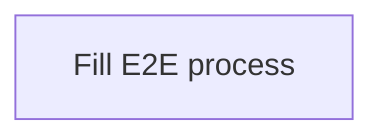
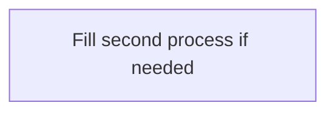

# 02 — Business Process

**Pack:** Business (ArchiMate)  
**RACI:** BA/PO **R**, Business Owner **A**, EA/SA/Sec/Test **C**  
**Handbook:** §3.1, §4.2  
**Language:** ArchiMate only — process boxes and `triggering` / fail paths. No C4 containers or protocol labels on this diagram.  
**Glossary:** [20-appendix.md](20-appendix.md)  
**Names:** Application Component column uses the name-identity list on [00-index.md](00-index.md).

## Diagram header

```
Title:      ________________________________
Viewpoint:  ArchiMate / C4 / UML ___________
Layer(s):   Strategy / Business / App / Tech
As-Is | To-Be | Transition:  _______________
Owner:      Role ________  Name ____________
Version:    v____  Date ________  Status Draft|Review|Approved
Legend:     relationships listed
Scope:      in-scope systems / out-of-scope
```

## Status

| Field | Value |
| --- | --- |
| Status | Draft / Review / Approved / N/A |
| N/A reason | |
| Owner | |
| Date | |

## Purpose

Primary E2E business process. Additional processes (inquiry, exception, …) get their own diagram and step table.

## Primary process

**Name:**



| Step | Business Role | Business Service | Business Object | Application Component |
| --- | --- | --- | --- | --- |
| | | | | |
| | | | | |

## Additional process (optional)

**Name:**



| Step | Business Role | Business Service | Business Object | Application Component |
| --- | --- | --- | --- | --- |
| | | | | |
