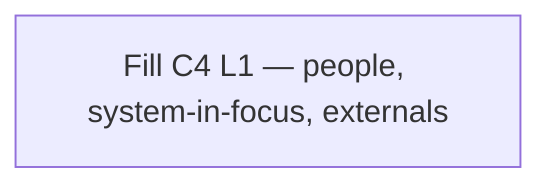

# 05 — C4 Context (L1)

**Pack:** Solution (C4)  
**RACI:** SA **R**, Business Owner **A**, EA/BA **C**  
**Handbook:** §3.1, §4.7  
**Language:** C4 Context only. Relationships are *what happens*, not protocol. No internal containers.  
**Glossary:** [20-appendix.md](20-appendix.md)  
**Names:** [00-index.md](00-index.md)

## Diagram header

```
Title:      ________________________________
Viewpoint:  ArchiMate / C4 / UML ___________
Layer(s):   Strategy / Business / App / Tech
As-Is | To-Be | Transition:  _______________
Owner:      Role ________  Name ____________
Version:    v____  Date ________  Status Draft|Review|Approved
Legend:     relationships listed
Scope:      in-scope systems / out-of-scope
```

## Status

| Field | Value |
| --- | --- |
| Status | Draft / Review / Approved / N/A |
| N/A reason | |
| Owner | |
| Date | |

## Purpose

People + system-in-focus + external systems only. No internals (no containers, databases, gateways, buses).

Use Mermaid `flowchart` — do **not** use native `C4Context` syntax.


