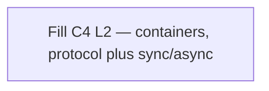

# 06 — C4 Container (L2)

**Pack:** Solution (C4)  
**RACI:** SA **R**, DA/Sec/Dev/Ops **C**  
**Handbook:** §3.1, §4.8  
**Language:** C4 Container. Edge label = interaction + **protocol + sync vs async**. Same strings as [08](08-application-cooperation.archimate.md).  
**Glossary:** [20-appendix.md](20-appendix.md)  
**Names:** [00-index.md](00-index.md)

## Diagram header

```
Title:      ________________________________
Viewpoint:  ArchiMate / C4 / UML ___________
Layer(s):   Strategy / Business / App / Tech
As-Is | To-Be | Transition:  _______________
Owner:      Role ________  Name ____________
Version:    v____  Date ________  Status Draft|Review|Approved
Legend:     relationships listed
Scope:      in-scope systems / out-of-scope
```

## Status

| Field | Value |
| --- | --- |
| Status | Draft / Review / Approved / N/A |
| N/A reason | |
| Owner | |
| Date | |

## Purpose

Runnable / deployable building blocks inside the system boundary. Same people and `System_Ext` names as L1. Do not collapse several channel (or other) containers into one box if L2 has distinct names.

Use Mermaid `flowchart` — do **not** use native `C4Container` syntax.


