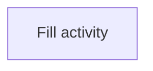
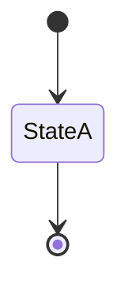

# 12 — UML Activity / State

**Pack:** Design (UML)  
**RACI:** Test **R**, BA **A**, Dev/SA **C**  
**Handbook:** §3.1, §4.12  
**Language:** UML Activity + State. Testers own coverage of both.  
**Glossary:** [20-appendix.md](20-appendix.md)  
**Names:** [00-index.md](00-index.md)

## Diagram header

```
Title:      ________________________________
Viewpoint:  ArchiMate / C4 / UML ___________
Layer(s):   Strategy / Business / App / Tech
As-Is | To-Be | Transition:  _______________
Owner:      Role ________  Name ____________
Version:    v____  Date ________  Status Draft|Review|Approved
Legend:     relationships listed
Scope:      in-scope systems / out-of-scope
```

## Status

| Field | Value |
| --- | --- |
| Status | Draft / Review / Approved / N/A |
| N/A reason | |
| Owner | |
| Date | |

## Purpose

**Activity** = workflow / decisions. **State** = lifecycle of **one** business or data object named in [04](04-information-structure.archimate.md).

**Object for state machine:**

**Allowed statuses:**

## Activity



## State


