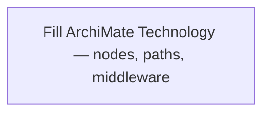

# 13 — Technology (ArchiMate)

**Pack:** Architecture (ArchiMate)  
**RACI:** Ops **R**, SA **A**, Sec/Dev **C**  
**Handbook:** §3.1, §4.5  
**Language:** ArchiMate Technology — logical nodes, environments, middleware. Not C4 Deployment ([07](07-c4-deployment.md)).  
**Glossary:** [20-appendix.md](20-appendix.md)  
**Names:** [00-index.md](00-index.md)

## Diagram header

```
Title:      ________________________________
Viewpoint:  ArchiMate / C4 / UML ___________
Layer(s):   Strategy / Business / App / Tech
As-Is | To-Be | Transition:  _______________
Owner:      Role ________  Name ____________
Version:    v____  Date ________  Status Draft|Review|Approved
Legend:     relationships listed
Scope:      in-scope systems / out-of-scope
```

## Status

| Field | Value |
| --- | --- |
| Status | Draft / Review / Approved / N/A |
| N/A reason | Mandatory if runtime changes |
| Owner | |
| Date | |

## Purpose

Logical nodes, environments, and middleware. Assignment of application components to nodes.



| Node / system software | Environment | Assigned components | Path |
| --- | --- | --- | --- |
| | | | |
